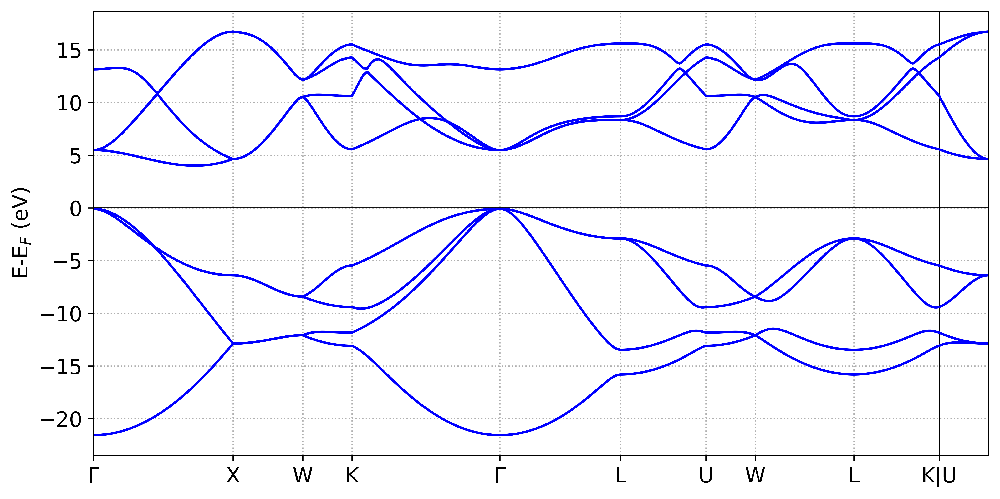
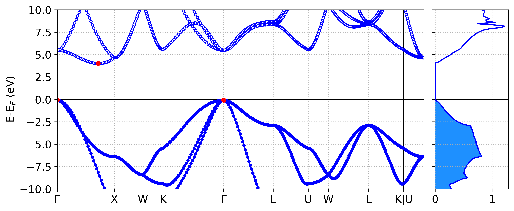

# plvasp

This is a small toolkit to plot DOS, bandstructure and DOS+bandstructure in a nice way using matplotlib.
It relies on vaspkit, so vaspkit needs to be callable from command-line command if you want to generate dos and band files.
If the files were already generated with vaspkit the execution is not needed.
The plot is saved as a png file in the wokring directory.

Commands:
 
Mandatory (one of these formats):

`-d (FILE)`             : plot DOS. If FILE is not specified, it is assumed to be the TDOS.dat in the working directory.

`-b (FILE)`             : plot bandstructure. If FILE is not specified, it is assumed to be the REFORMATTED_BAND.dat in the working directory.

`-d (FILE) -b (FILE)`   : plot DOS and bandstructure together (sharing y axis)

Optional:

`-o OUTPUTFILE`         : specify custom ouput file name and location 

`--m`                   : plot red points at the conduction band minimum (CBM) and valence band maximum (VBM) in the band structure

`--r MIN MAX`           : energy range (both for DOS and bandstructure)

`--points`              : draws bandstructure also with data points on top of lines

`--su, --sd, --sud`     : plot spin up, down or both for DOS. If the calculation is non-spin polarized, this option will be ignored

If the TDOS.dat or REFORMATTED_BAND.dat files do not exist in the working directory or at the specified location, you will be asked if you want to try to generate them with vaspkit,
in which case you need to confirm by typing 'y'.

Some example plots with the different options:

`$ plvasp -d`

`$ plvasp -b`

`$ plvasp -d -b`

